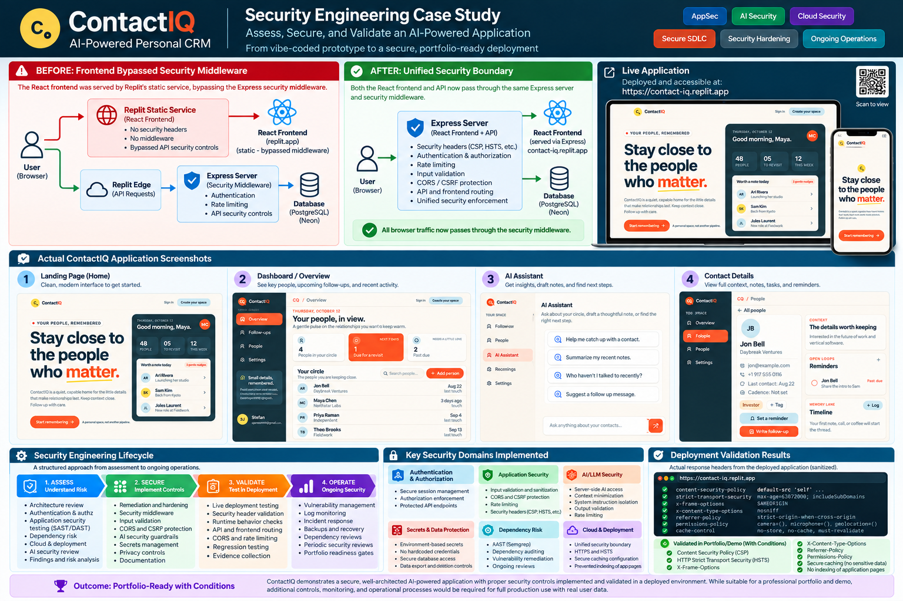
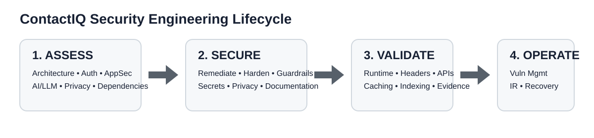
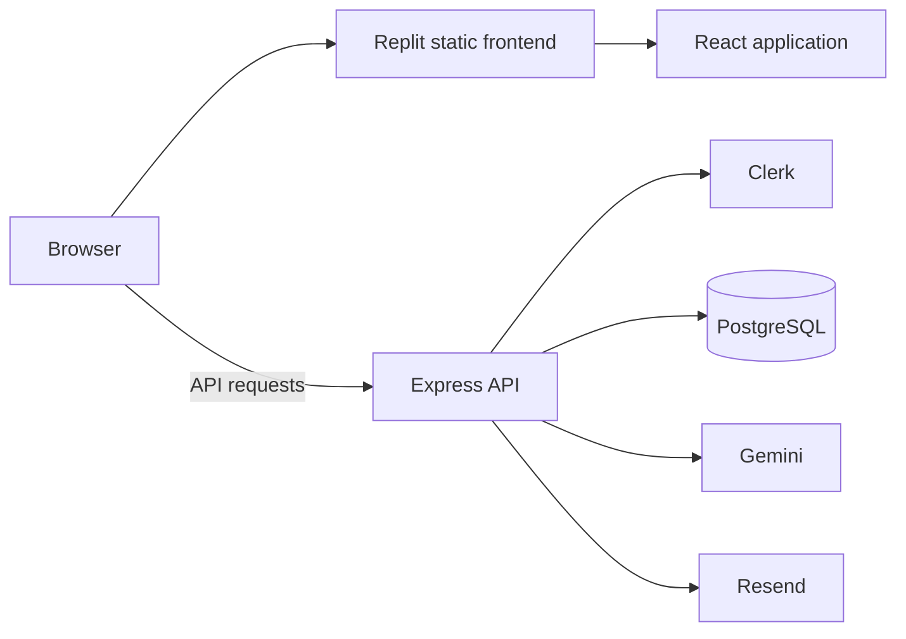
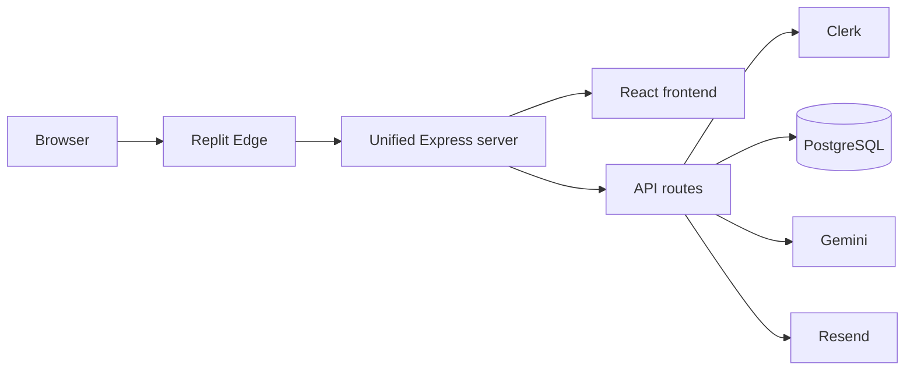
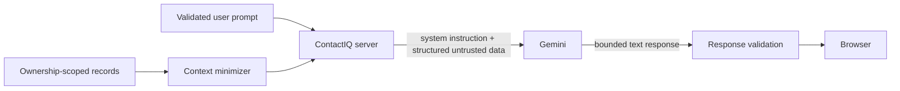

# Securing an AI-Assisted SaaS Application

## ContactIQ — Security Engineering Case Study

ContactIQ is a personal relationship-management application built with an AI-assisted development workflow. I used the project to answer a practical security question:

> **What does it take to move an AI-assisted application from “it works” toward a defensible production security posture?**

Rather than treating security as a final scan, I assessed the application across architecture, authentication, authorization, data isolation, application security, AI/LLM security, privacy, dependency risk, deployment behavior, and operational readiness.

The most important finding was not a vulnerable dependency or an obvious coding flaw. It was a **deployment architecture gap**: security middleware existed in the Express application, but the deployed React frontend was being served through a separate static path and therefore bypassed those controls.

The remediation changed the production serving model so the frontend and API traverse a unified Express security boundary.

**ASSESS → SECURE → VALIDATE → OPERATE**

[**Live ContactIQ Demo**](https://contact-iq.replit.app/) · [Architecture](docs/architecture.md) · [Security Controls](docs/security-controls.md) · [AI Security](docs/ai-security.md) · [Production Readiness](docs/production-readiness.md)

## Executive case-study overview

*Sanitized portfolio summary of the application, deployment finding, remediation, implemented controls, and validation results.*

### Security engineering lifecycle

---

## Architecture

### Before — split frontend and API paths

Express middleware protected requests that reached Express, but browser requests for the frontend followed the static serving path.

### After — unified security boundary

The production build now serves the React frontend and API through one Express service, making the deployed request path align with the intended security controls.

---

## Security assessment scope

The review covered:

- Authentication, authorization, and server-side ownership enforcement
- Deployment architecture and browser security controls
- CORS, CSRF protections, rate limiting, and request-size limits
- Input and CSV-import validation
- Secrets and third-party provider boundaries
- AI/LLM context handling, prompt boundaries, PII minimization, and output limits
- Privacy export and account deletion
- Structured logging and security audit events
- Dependency and supply-chain indicators
- Incident response, vulnerability management, secret rotation, and recovery readiness

## Key findings

| Area | Finding | Remediation / status |
|---|---|---|
| Deployment architecture | Static frontend bypassed Express security middleware | Unified frontend and API behind Express |
| Authorization | Browser state could not be treated as authorization | Server-side identity and ownership conditions applied to resource operations |
| AI/LLM | Application records and prompts can contain sensitive or instruction-like data | Structured untrusted context, ownership scoping, minimization, hard limits |
| Logging | Security evidence did not require raw sensitive content | Minimized structured logs and audit metadata |
| Privacy | Account deletion crosses local and identity-provider boundaries | Transactional local deletion, audit anonymization, explicit external-provider handling |
| Recovery | Provider capability does not prove recoverability | Backup/restore verification remains a customer-production requirement |

## AI / LLM security

Gemini is invoked from the server rather than directly from the browser. The implementation separates trusted system instructions from structured application context and user input, explicitly treats those inputs as untrusted, scopes context to the authenticated user, minimizes data sent to the model, and bounds context and output size.

The assistant is text-only: it cannot modify contacts, create reminders, send email, invoke tools, or perform autonomous actions.

Authenticated prompt-injection testing remains part of the pre-customer-production gate.

## Validation

The final engineering review included successful application/API builds and typechecking, dependency auditing with zero known vulnerabilities reported by the supported audit, and supported static/security scans that reported no findings.

Deployment validation also confirmed browser security headers on the unified serving path, private-route no-index behavior, API no-store behavior, correct API/frontend fallback separation, immutable caching for hashed assets, and a single HSTS policy supplied at the hosting edge.

These results are evidence of the tested controls; they are **not** a claim of complete security or a penetration test.

## Readiness

**Portfolio / demo:** Pass with conditions.

**Customer production:** Additional authenticated and operational validation is required, including two-user authorization/IDOR testing, authenticated CSRF testing, privacy export/deletion testing, Gemini prompt-injection testing, provider runtime testing, and verified backup/restore evidence.

## Case-study documents

- [Architecture](docs/architecture.md)
- [Findings](docs/findings.md)
- [Security controls](docs/security-controls.md)
- [AI security](docs/ai-security.md)
- [Production readiness](docs/production-readiness.md)

## Key lessons

1. Validate the **deployed request path**, not only source-level middleware.
2. Enforce identity and tenant ownership in server-side queries and mutations.
3. Treat user prompts and application records as untrusted AI input.
4. Minimize provider context, logs, and audit metadata by default.
5. Separate local deletion guarantees from external-provider outcomes.
6. Clean scans are useful evidence, not proof of complete security.
7. Backup features do not prove recoverability; recovery requires verified evidence.

---

### Scope note

This project is a security-engineering case study. It does not claim a penetration test, certification, compliance assessment, complete production readiness, 24/7 monitoring, or independently verified provider-side retention/deletion behavior.
