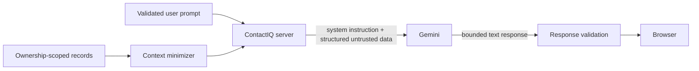

# ContactIQ AI Security Controls

This document covers controls implemented for the ContactIQ Gemini assistant. It does not claim that prompt injection is fully solved or that provider-side retention has been independently verified.

## Architecture

Gemini is called from the Express server. The browser sends a validated assistant request to ContactIQ; the server selects ownership-scoped application records, constructs minimized context, calls the provider, validates the result, and returns a bounded response.

The assistant cannot invoke tools, modify contacts, send email, create reminders, or perform other autonomous actions.

## Implemented controls

### Server-side provider access

Provider access is server-side only. Provider credentials are not sent to the browser.

### Instruction separation

System instructions use the provider's system-instruction channel. Application context and the user's request are supplied separately rather than interpolated into trusted instructions.

### Structured untrusted context

Application context and the user request are serialized separately and explicitly treated as untrusted. Record content and user text are not permitted to redefine system behavior.

### Ownership-scoped data

Contacts and reminders used for AI context are selected using the authenticated user's identity. Selected-contact flows require both the requested record and current-user ownership condition.

### Context minimization

General context includes only a small bounded set of contacts and open reminders. Selected-contact notes are included only when needed, text is truncated, and serialized application context has a hard size limit. If necessary, notes and then records are omitted to remain within that boundary.

### PII exclusions

Assistant context intentionally excludes contact email addresses, phone numbers, locations, birthdays, authentication credentials, API keys, and unrelated users' records.

Selected contact notes and reminder notes may be sent after truncation when needed for the feature.

### Context and output limits

The server bounds the number of context records, note lengths, serialized context size, user-message size, and provider output.

### Rate limiting

The assistant endpoint has a dedicated rate limit in addition to the general API limit. The current limiter is application-memory based and is not described as a distributed production quota system.

### No autonomous actions

The assistant is text-only. It does not receive tools, execute database changes, send messages, or perform actions on the user's behalf.

### No application conversation-history persistence

ContactIQ does not persist assistant conversation history. Each request uses the current validated prompt and newly selected minimized context. This statement does not assert provider-side retention or training behavior.

### Sanitized provider failures

Provider failures return a generic unavailable response. Internal logging is limited to non-content failure metadata rather than raw provider responses, prompts, contact context, or credentials.

## Remaining pre-production requirement

Authenticated prompt-injection validation remains outstanding. Testing should cover instruction-like contact notes, reminder text, direct user prompts, attempts to obtain hidden instructions, oversized inputs, and cross-user data-access attempts.

Any future autonomous action/tool integration would materially change the threat model and require a new review.
