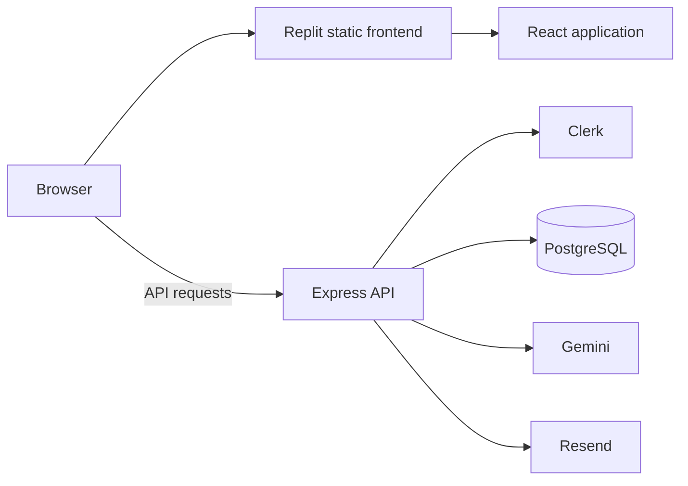
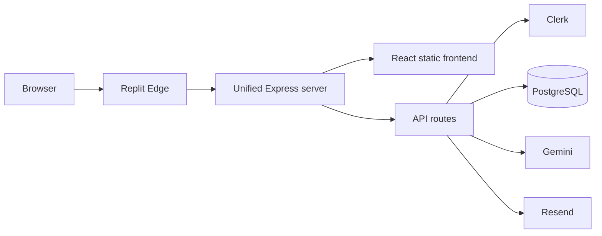
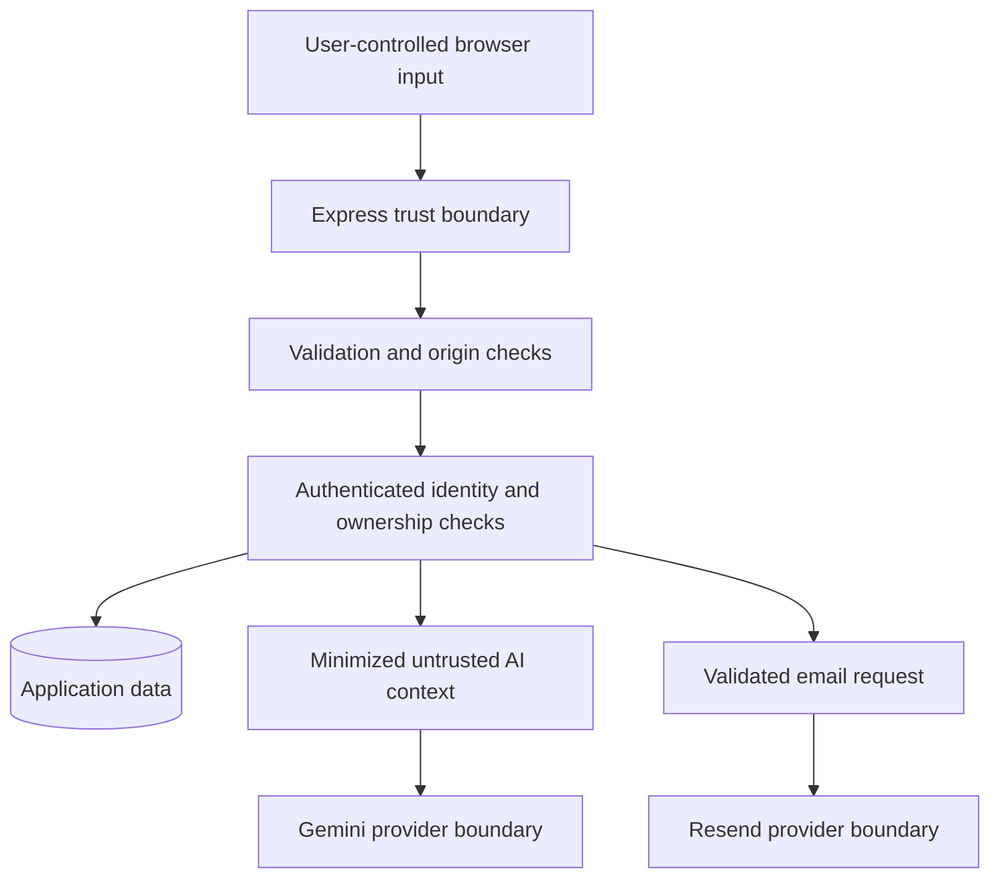

# ContactIQ Deployment Architecture

## Before: split frontend and API paths

The original deployment exposed the built frontend through a static service while API requests were handled by Express. Express middleware applied only after a request reached Express.

This meant browser requests for the application document and static assets bypassed the server layer responsible for browser security headers and related response behavior. Secure middleware in source code therefore did not prove that the deployed frontend received those controls.

## After: unified Express serving

The production build creates the frontend and API bundles and runs one Express service. Express serves frontend assets, returns the application shell for eligible frontend routes, and preserves the API boundary.

## Security implications

The unified path allows browser security controls to be enforced at one intended application layer while preserving distinct caching behavior for API responses, HTML, and hashed assets. API paths are excluded from the SPA fallback, private frontend routes can be marked non-indexable, and the application fails fast if the expected frontend build is unavailable.

Live deployment validation confirmed the intended browser security headers on representative frontend routes, API no-store behavior, private-route no-index behavior, correct API/frontend fallback separation, immutable caching for hashed assets, and one HSTS policy at the hosting edge.

## Trust boundaries

Authentication does not make contact data, notes, reminders, imports, or assistant prompts trusted. Validation, ownership checks, context minimization, and provider-specific failure handling remain required before data crosses downstream boundaries.

## Remaining runtime validation

Unified serving does not replace authenticated CSRF testing, two-user authorization/IDOR testing, or authenticated AI security testing. The Clerk worker/CSP interaction also remains a runtime verification item before customer production.
